<p align="center">
  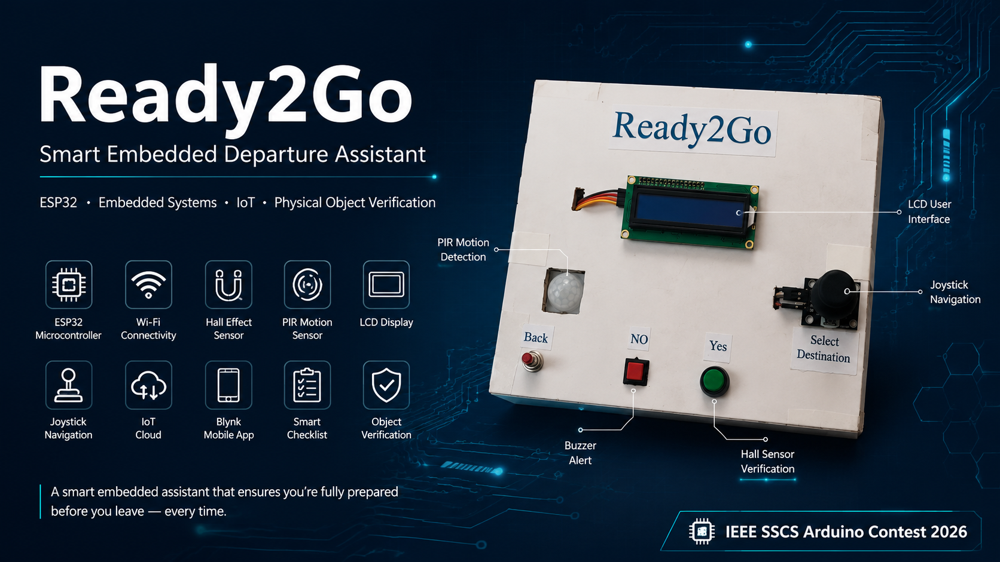
</p>

<h1 align="center">Ready2Go</h1>

<p align="center">
<b>Smart Embedded Departure Assistant</b><br>
Helping you leave home with confidence — never forget your essentials again.
</p>

<p align="center">


</p>

---

<table align="center">
<tr>

<td align="center" width="220">

### 📄 Project Report

Complete IEEE Documentation

<a href="Report/Ready2Go_Report.pdf">

View PDF →

</a>

</td>

<td align="center" width="220">

### ▶ Demo Video

Watch Ready2Go in Action

<a href="https://youtu.be/xozcsi4o3Z0?si=FPg_Io4ks2JNHsAm">

Watch on YouTube →

</a>

</td>

<td align="center" width="220">

### ⚡ Wokwi Simulation

Run the Embedded Prototype

<a href="https://wokwi.com/projects/470927609513027585">

Open Simulation →

</a>

</td>

</tr>
</table>

---

<p align="center">
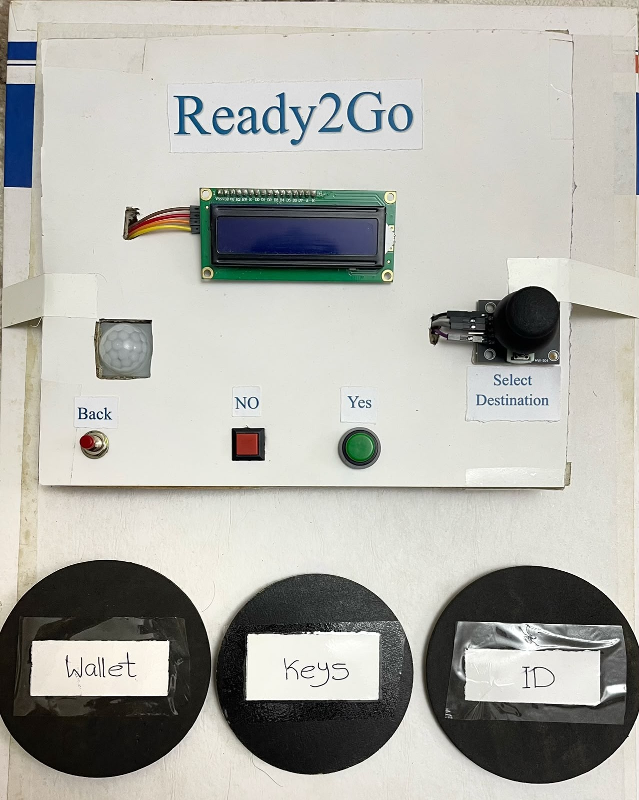
</p>

<p align="center">
<b>ESP32-based Embedded Smart Departure Assistant</b>

<br>

Designed for the IEEE SSCS Arduino Contest 2026
</p>

---

# 📖 Overview

**Ready2Go** is an ESP32-powered smart embedded assistant that helps users avoid leaving home without their essential belongings.

Instead of relying on manual reminder applications, the system combines **destination-aware checklists**, **physical object verification**, and **real-time IoT monitoring** to ensure important items have actually been taken before departure.

Whenever a person approaches the entrance, a PIR sensor automatically activates the system. The user selects a destination using a joystick, receives a customized checklist, and confirms each required item. Critical belongings such as keys, wallet, and student ID are physically verified using Hall-effect sensors before the departure session is completed.

The system is also connected to the **Blynk IoT platform**, enabling real-time monitoring, readiness tracking, and custom destination management directly from a mobile device without modifying the firmware.

---

## 🚀 Quick Facts

| Property | Details |
|-----------|---------|
| **Project Type** | Embedded Systems + IoT |
| **Microcontroller** | ESP32 DevKit V1 |
| **Programming Language** | Arduino C++ |
| **IoT Platform** | Blynk |
| **Simulation** | Wokwi |
| **Development Environment** | Arduino IDE |
| **Competition** | IEEE SSCS Arduino Contest 2026 |

---

# 🚀 Highlights

| | |
|:--|:--|
| 🧠 **Dynamic Checklist** | Automatically generates destination-specific checklists |
| 🧲 **Physical Verification** | Hall-effect sensors verify important belongings |
| 📊 **Readiness Score** | Calculates departure readiness in real time |
| ☁️ **IoT Dashboard** | Live synchronization with Blynk Cloud |
| 📍 **Custom Destinations** | Create new destinations without updating firmware |
| 🔔 **Smart Alerts** | Continuous buzzer notifications for forgotten items |
| 🏃 **Automatic Activation** | PIR sensor starts the system when someone approaches |
| 📱 **Mobile Monitoring** | View system status remotely using Blynk |

---

## 📑 Contents

- Overview
- Key Features
- System Architecture
- Hardware Design
- User Interface
- IoT Dashboard
- Wokwi Simulation
- Repository Structure
- Getting Started
- Future Improvements
- Team
- License

---
# 🏗 Architecture

Ready2Go is built around a modular embedded architecture where sensing, decision-making, hardware verification, user interaction, and cloud communication operate as independent modules.

<p align="center">
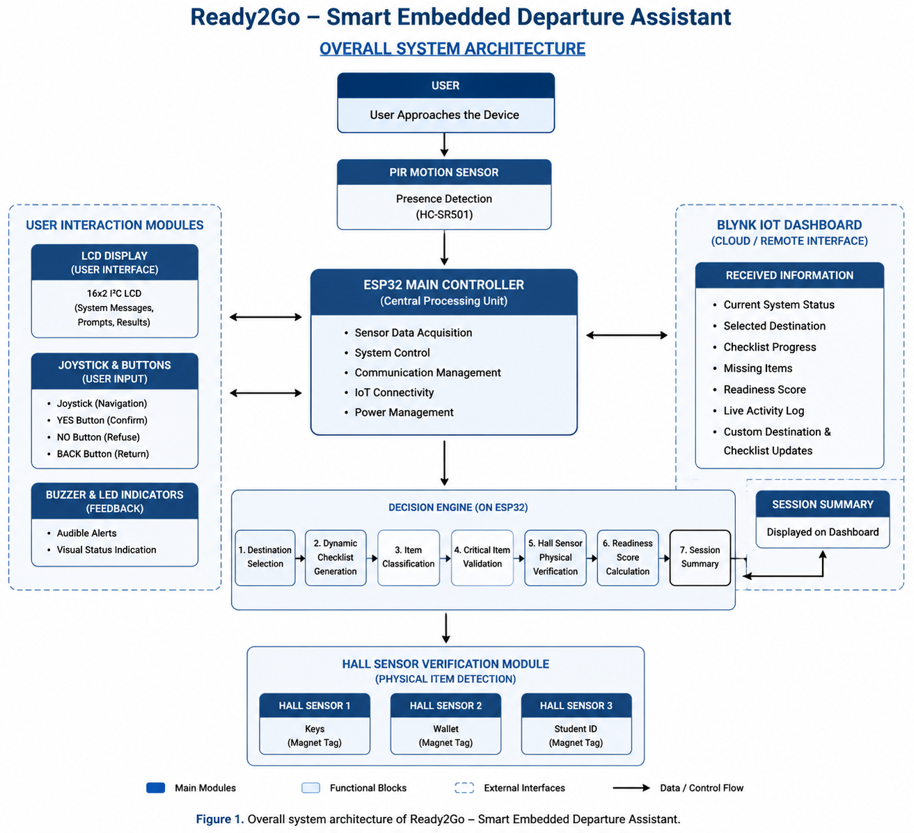
</p>

<p align="center">
<i>Overall software architecture of the Ready2Go system.</i>
</p>

---

# 🔩 Hardware Design

The prototype combines the ESP32 with multiple sensors and peripherals to provide an intelligent departure assistant capable of physical object verification.

---

## Hardware Block Diagram

<p align="center">
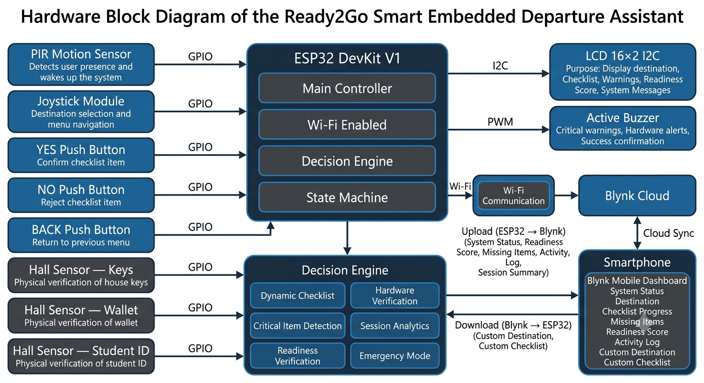
</p>

<p align="center">
<i>High-level interaction between all hardware modules.</i>
</p>

---

## ESP32 Pin Mapping

<p align="center">
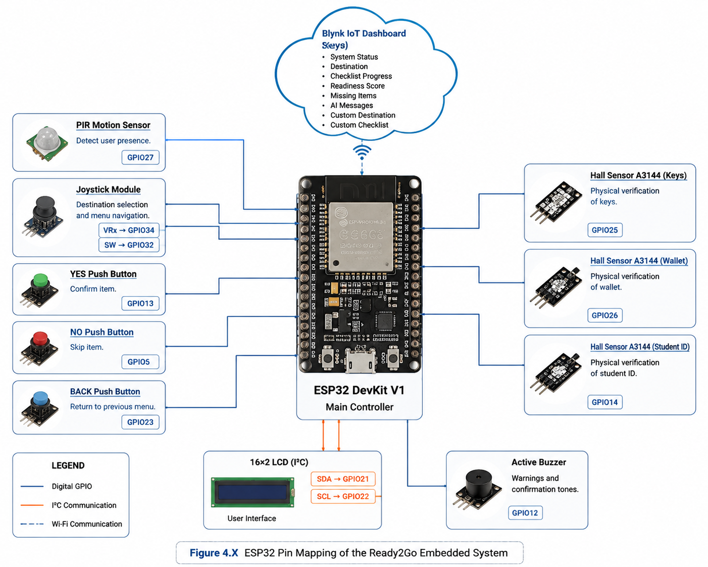
</p>

<p align="center">
<i>GPIO allocation used throughout the prototype.</i>
</p>

---

## Hardware Assembly

<p align="center">
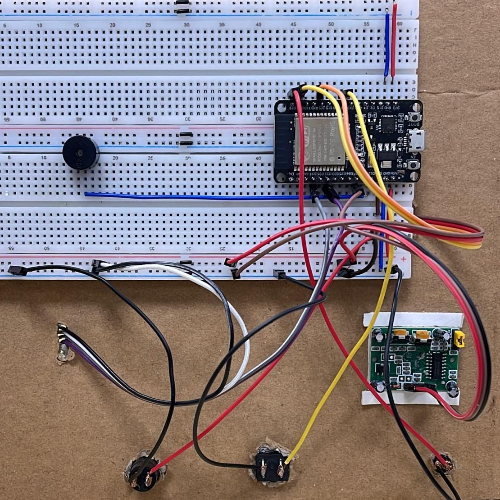
</p>

<p align="center">
<i>Final hardware prototype assembled and tested on breadboard.</i>
</p>

---

# 🖥 Embedded User Interface

<table align="center">

<tr>

<td align="center">

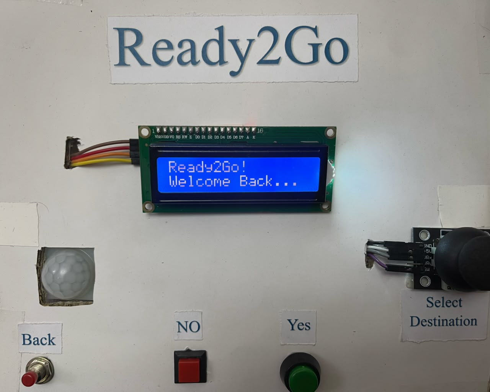

### Welcome

</td>

<td align="center">

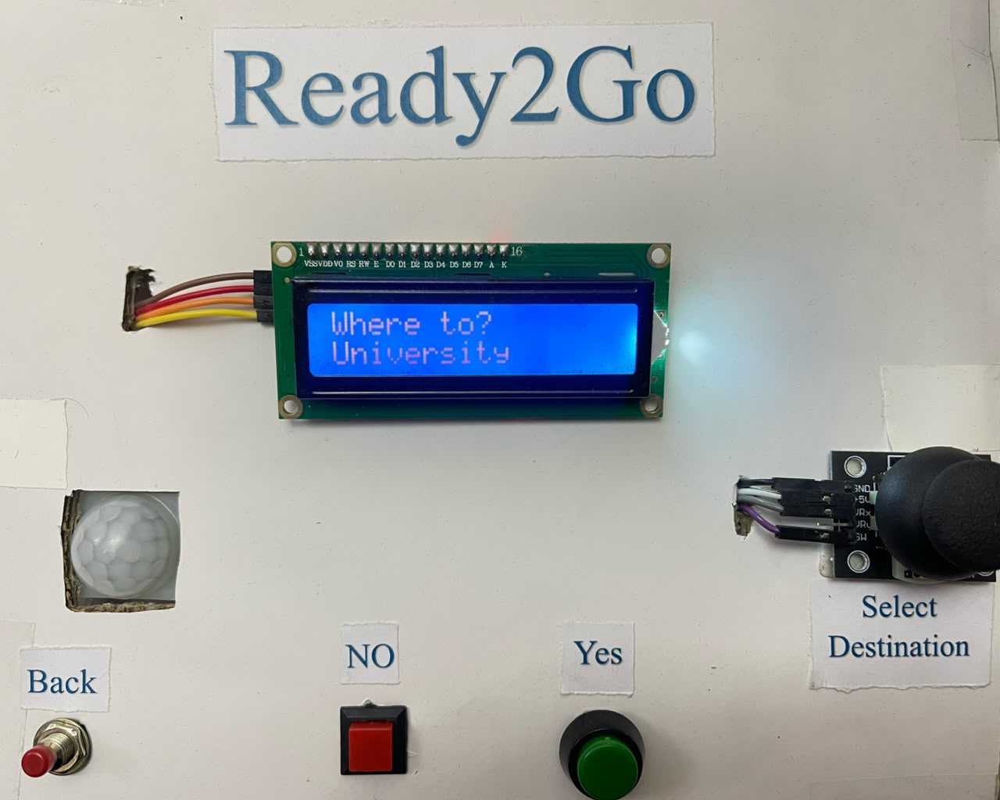

### Destination Selection

</td>

</tr>

</table>

The LCD and joystick provide a simple embedded interface for navigating destinations, checklist items, and system feedback.

---

# ☁ IoT Dashboard

<table align="center">

<tr>

<td align="center">

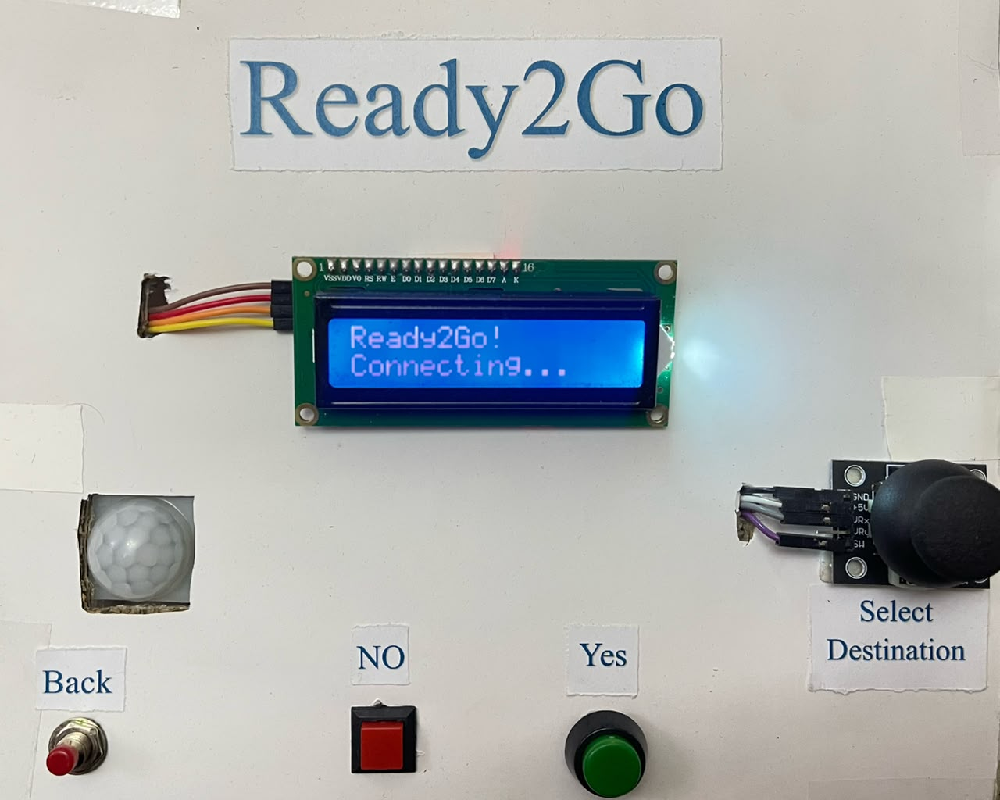

### Cloud Connection

</td>

<td align="center">

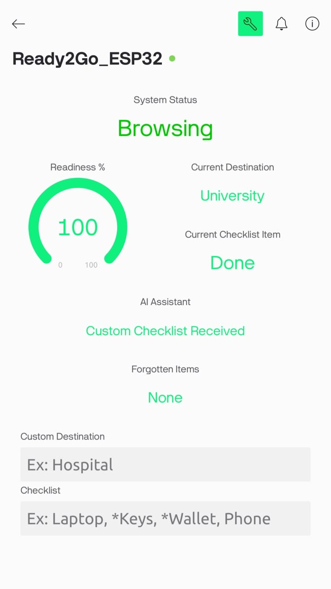

### Live Dashboard

</td>

</tr>

</table>

Using the Blynk platform, users can monitor the system remotely, view readiness status, and create custom destinations without updating the firmware.

---

# ⚡ Simulation

The complete embedded system was validated in **Wokwi** before hardware implementation.

<p align="center">

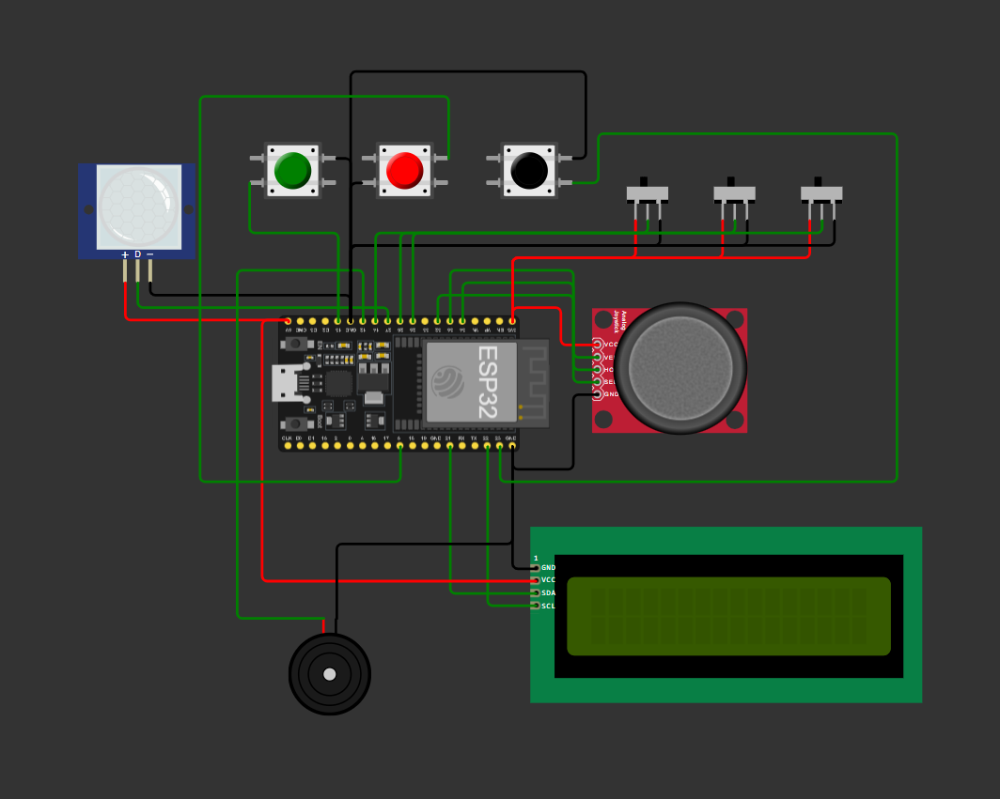

</p>

<p align="center">

<a href="https://wokwi.com/projects/470927609513027585">

<b>Open Interactive Simulation →</b>

</a>

</p>

---
# 🛠 Technologies

| Technology | Purpose |
|------------|---------|
| ESP32 DevKit V1 | Main embedded controller |
| Arduino IDE | Firmware development |
| Arduino C++ | Embedded programming |
| Blynk IoT | Cloud communication |
| Wokwi | Circuit simulation |
| Hall Effect Sensors | Physical object verification |
| PIR Motion Sensor | Motion detection |
| LCD 16×2 I2C | Embedded user interface |
| Analog Joystick | User navigation |
| Active Buzzer | Audible alerts |

---

# 📂 Repository Structure

```text
Ready2Go-Smart-Embedded-Departure-Assistant
│
├── Images/
│   ├── cover.png
│   ├── prototype.jpeg
│   ├── hardware_connections.jpeg
│   ├── hardware_block_diagram.png
│   ├── system_architecture.png
│   ├── pin_mapping.png
│   ├── wokwi.png
│   ├── welcome_back.jpeg
│   ├── where_to.jpeg
│   ├── connecting.jpeg
│   └── blynk_dashboard.jpeg
│
├── Source_Code/
│   └── Ready2Go.ino
│
├── Report/
│   └── Ready2Go_Report.pdf
│
├── Resources/
│
└── README.md
```

---

# 🚀 Getting Started

### 1. Clone the repository

```bash
git clone https://github.com/AhmedSamirNU/Ready2Go-Smart-Embedded-Departure-Assistant.git
```

### 2. Open the project

Open the **Source_Code** folder using **Arduino IDE**.

### 3. Install required libraries

- Blynk
- LiquidCrystal_I2C

### 4. Install ESP32 Board Package

Boards Manager → **Espressif ESP32**

### 5. Configure Blynk

Update:

- Template ID
- Device Name
- Auth Token

inside the source code.

### 6. Upload

Select:

```
ESP32 Dev Module
```

Upload the firmware.

---

# 🔮 Future Improvements

- RFID-based automatic item identification
- Voice assistant integration
- AI-powered personalized recommendations
- Push notifications
- Cloud analytics
- Battery-powered standalone version

---

# 👥 Team

| Name | Contribution |
|------|--------------|
| **Ahmed Samir** | Embedded Software • System Design |
| **Ahmed Eltanany** | Hardware Integration |
| **Mohamed Aboelkasem** | Testing • Documentation |

<p align="center">

Electronics and Communications Engineering

Nile University

IEEE SSCS Arduino Contest 2026

</p>

---

# 🤝 Contributing

Contributions, ideas, and improvements are always welcome.

If you'd like to improve Ready2Go, feel free to fork the repository and submit a Pull Request.

---

# 📜 License

This project is licensed under the **MIT License**.

See the LICENSE file for more information.

---

<p align="center">

Made with ❤️ by Team Ready2Go

</p>

<p align="center">

ESP32 • Embedded Systems • IoT • Nile University • IEEE SSCS 2026

</p>
